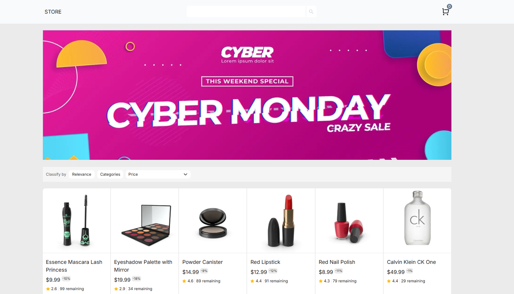
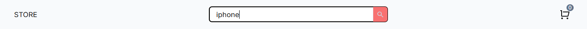
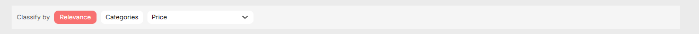
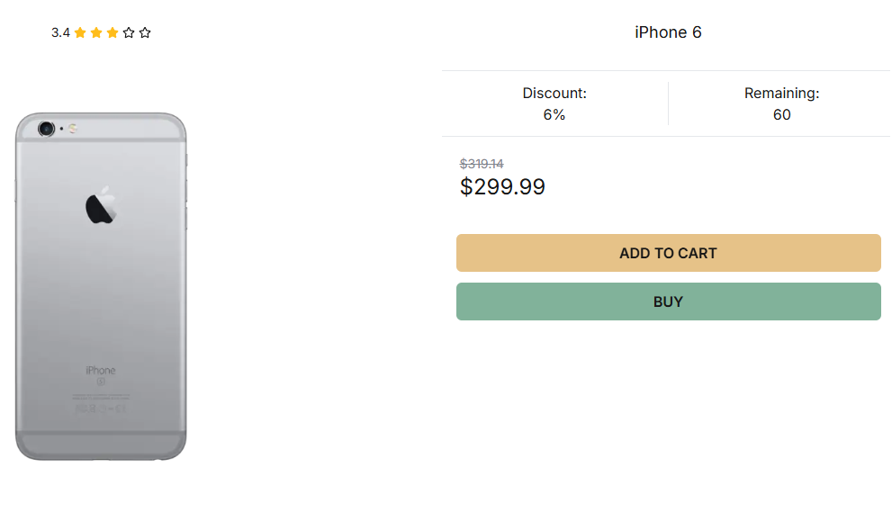
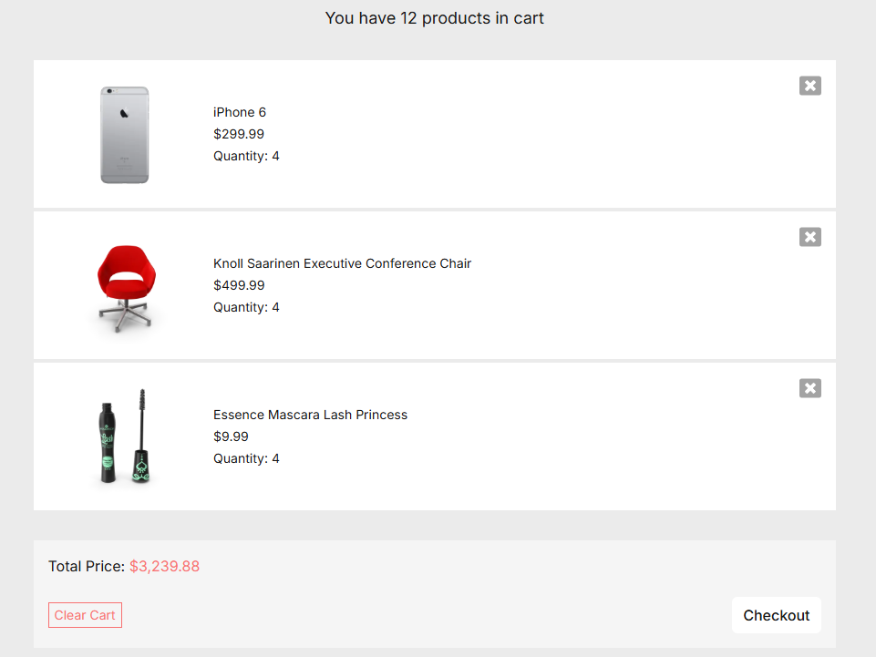

# FAKE-STORE



## Table of Contents

- [About the Project](#about-the-project)
- [Features](#features)
- [Built with](#built-with)
  - [Pagination](#pagination)
  - [Search Product](#search-product)
  - [Filter Products](#filter-products)
  - [Add product to cart](#add-product-to-cart)
  - [Cart](#cart)
  - [URL State](#url-state)
- [Run the application](#run-the-application)
- [Author](#author)
- [License](#license)

## About the project

This application simulate an e-commerce with the basic functionalities such as adding products to the cart, searching for products, and filtering them. This was possible by using the [dummyjson](https://dummyjson.com) API.

## Features

The application has the following features:

### Pagination


It's possible to view more products by navigating through the pagination.

### Search product



Here, you can search for a product by entering its name.

### Filter products



It's possible to filter products by category, price and relevance.

### Add Product to cart


Here, the user can add a product to cart of its choice.

### Cart



After a user adds a product to the cart, it appears here. The user can remove individual products or clear the entire cart. The total amount of all products in the cart is also displayed.

### URL State

The filter state stays in the URL, so users can share the current filter settings with others. It's applied in the following cases:

- Pagination: the current page
  - `https://fake-store.com/?page=2`
- Filter products: the current price or relevance filtering settings
  - `https://fake-store.com/?sort=rating&order=desc`
- All
  - `https://fake-store.com/?page=2&sort=rating&order=desc`

## Built with

This project was built with the following technologies:

| Technologies                                                                                | Description                                                                               |
| ------------------------------------------------------------------------------------------- | ----------------------------------------------------------------------------------------- |
| [Next.js ](https://nextjs.org)                                                              | A framework for building static and dynamic web applications.                             |
| [React ](https://react.dev)                                                                 | A library for web and native user interfaces.                                             |
| [TypeScript ](https://www.typescriptlang.org/)                                              | A strongly typed programming language built on JavaScript.                                |
| [TanStack React query ](https://tanstack.com/query)                                         | An asynchronous state management library.                                                 |
| [React Paginate ](https://www.npmjs.com/package/react-paginate)                             | A ReactJS component to render a pagination.                                               |
| [Redux ](https://redux.js.org/)                                                             | A global state management library.                                                        |
| [Jest ](https://jestjs.io/)                                                                 | A framework testing.                                                                      |
| [React Testing Library ](https://testing-library.com/docs/react-testing-library/intro/)     | A very light-weight solution for testing React components.                                |
| [TailwindCSS ](https://tailwindcss.com)                                                     | A utility-first CSS framework packed with classes.                                        |
| [React Slick ](https://react-slick.neostack.com/)                                           | A library for carousels.                                                                  |
| [Clsx ](https://www.npmjs.com/package/clsx)                                                 | A tiny utility for constructing classname strings conditionally.                          |
| [Tailwind Merge ](https://www.npmjs.com/package/tailwind-merge)                             | Utility function to efficiently merge Tailwind CSS classes in JS without style conflicts. |
| [React Icons ](https://react-icons.github.io/react-icons/)                                  | Easily include popular icons in React projects.                                           |
| [Prettier ](https://prettier.io/)                                                           | A code formatter.                                                                         |
| [Prettier TailwindCSS ](https://tailwindcss.com/blog/automatic-class-sorting-with-prettier) | A plugin for sorting classes with Prettier.                                               |
| [Eslint ](https://eslint.org/)                                                              | Find and fix problems in JavaScript code.                                                 |

## Run the application

To run the application on your machine, follow the next steps:

1. Clone the repositorie

   ```sh
   git clone https://github.com/JhowBRCG/fake-store.git
   ```

2. Install the dependencies

   ```sh
   npm install
   # or
   yarn install
   # or
   pnpm install
   ```

3. Initialize the server

   ```sh
   npm run dev
   # or
   yarn dev
   #or
   pnpm dev
   ```

4. Now you can see the application in real time by putting the url http://localhost:3000/ in the browser of your choice.

## Author

Created by [@jhowbrcg](https://github.com/JhowBRCG) - fell free to contact me!
